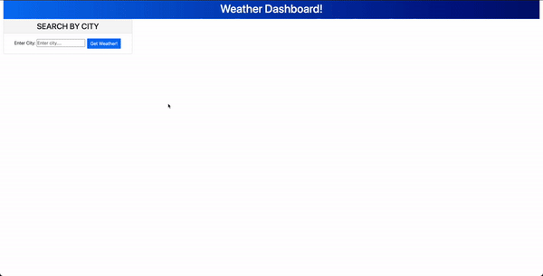

# Weather Dashboard

## Features
```
User are able to seach for known cities around the world.
Once a city is entered the weather data for that city is displayed.
This will also display a 5-Day forecast for that area.
A bar on the left shows up once a user has typed a city and will create a list of usable cities to click again.
```

## [Link to the deployed website](https://kcmuse.github.io/Weather-Dashboardhw6/)

### Preview of deployed site 
